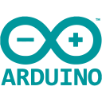

### My name is Dalibor and I like programming!
#### I can mainy programm in C++, C#, Javascript and also websites if that's considered as programming + many more

### Languages and tools I use and know

 
 
 

### Contact
- [Twitter](https://twitter.com/daliborin)
- [LinkedIn](https://www.linkedin.com/in/dalibortrampota/)
- Discord: KokoNeot#9150
- Email: dalibor(dot)trampota(at)gmail(dot)com (formatted this way against bots)

### I'm currently working on enhancing my Discord music bot KokNut

- [KokNut](https://koknut.xyz)
- [Vote](https://top.gg/bot/583995825269768211)

## About KokNut

 - KokNut is a bot mainly focused on music, but it has many other tools and features as well
 
 - **Music**
   - Youtube, Soundcloud, Spotify, Apple music and File support (more coming soon) 
   - Free audio filters for now (once the bot gets over 2000 servers filters will degrade the performance greatly)
   - Save your favorite playlists for fast replay
 
 - **Tools**
   - **Timezones** - Whenever user mentions time and has set his timezone a clock reaction will pop up. If you set your timezone you can react and message with your time will be send
   - **Embeds** - If you want to build an embed like you would using code you can do so with modular **embed** command
   - **Base converter** - Convert between binary, hex or any other base
   
 - **Economy**
   - KokNut has advanced economy. You can open your **farm** or start **fishing**.
 
 - **Moderation**
   - You can disable and enable commands or command categories with **turn** command. You can specify where you want to disable the command, current category or chat? or the whole server?
   - Temp ban and mute or kick will help you deal with naughty users
   - Delete x number of last messages or from specific user using **clear** command
   
#### If you have any suggestions or you want specific feature added, feel free to use **suggest** command and I'll try my best to deliver the feature to you in the next update

### Github Stats

